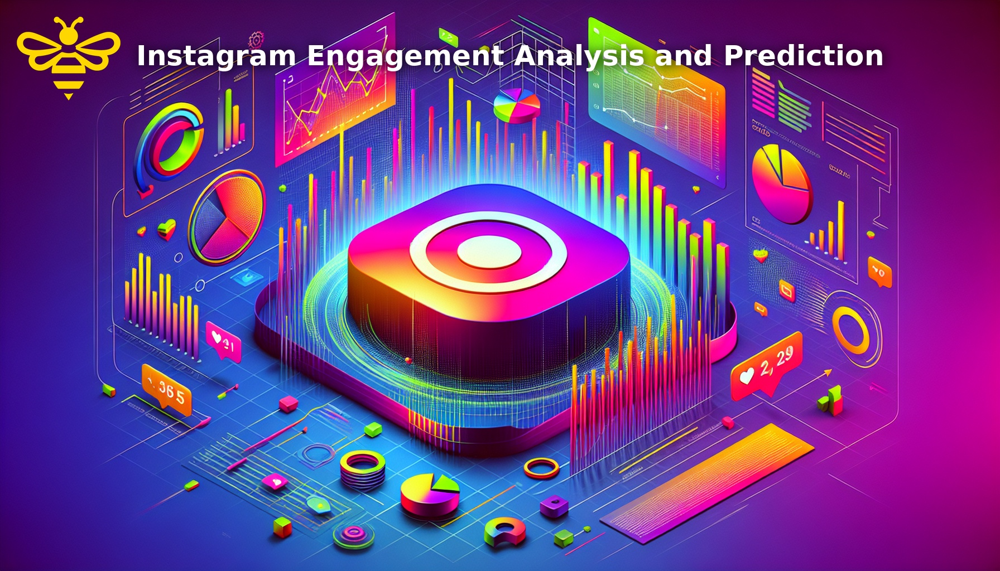

# 📊 Instagram Post Performance Analyzer

## Overview
This project analyzes Instagram post performance using real engagement data to understand **what drives reach and follower growth**.  
Using exploratory data analysis, small-data machine learning, and interpretable metrics, the project provides actionable insights for content strategy rather than chasing artificial accuracy.

A simple Linear Regression model is used **for interpretability**, not blind prediction, and the insights are later showcased through a Flask web application.

---

## 📁 Dataset
The dataset contains **119 Instagram posts** with the following features:

- Reach metrics:  
  `Impressions`, `From Home`, `From Hashtags`, `From Explore`, `From Other`
- Engagement metrics:  
  `Likes`, `Comments`, `Shares`, `Saves`
- Conversion metrics:  
  `Profile Visits`, `Follows`
- Content data:  
  `Caption`, `Hashtags`

There are **no missing values**, allowing the focus to remain on analysis and insight generation.
